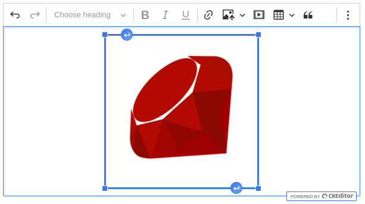

# CKEditor 5 Rails Integration ✨

[](https://www.gnu.org/licenses/old-licenses/gpl-2.0.en.html)


[](http://makeapullrequest.com)

[](https://github.com/Mati365/ckeditor5-rails/issues)

Unofficial CKEditor 5 Ruby on Rails integration gem. Provides seamless integration of CKEditor 5 with Rails applications through web components and helper methods.

<p align="center">
  
</p>

## Installation 🛠️

Add this line to your application's Gemfile:

```ruby
gem 'ckeditor5'
```

In your config (the default config is defined [here](https://github.com/Mati365/ckeditor5-rails/blob/main/lib/ckeditor5/rails/presets/manager.rb)):

```rb
# config/initializers/ckeditor5.rb

CKEditor5::Rails.configure do
  version '43.3.0'
end
```

In your layout:

```erb
<!-- app/views/layouts/application.html.erb -->

<!DOCTYPE html>
<html>
  <head>
    <%= yield :head %>
  </head>
  <body>
    <%= yield %>
  </body>
</html>
```

In your view:

```erb
<!-- app/views/demos/index.html.erb -->

<% content_for :head do %>
  <%= ckeditor5_assets %>
<% end %>

<%= ckeditor5_editor %>
```

Voilà! You have CKEditor 5 integrated with your Rails application. 🎉

## Table of Contents 📚

- [CKEditor 5 Rails Integration ✨](#ckeditor-5-rails-integration-)
  - [Installation 🛠️](#installation-️)
  - [Table of Contents 📚](#table-of-contents-)
  - [Presets 🎨](#presets-)
    - [Available Configuration Methods ⚙️](#available-configuration-methods-️)
      - [`cdn(cdn = nil, &block)` method](#cdncdn--nil-block-method)
      - [`version(version)` method](#versionversion-method)
      - [`gpl` method](#gpl-method)
      - [`license_key(key)` method](#license_keykey-method)
      - [`premium` method](#premium-method)
      - [`editable_height(height)` method](#editable_heightheight-method)
      - [`translations(*languages)` method](#translationslanguages-method)
      - [`ckbox` method](#ckbox-method)
      - [`type(type)` method](#typetype-method)
      - [`toolbar(*items, should_group_when_full: true, &block)` method](#toolbaritems-should_group_when_full-true-block-method)
      - [`menubar(visible: true)` method](#menubarvisible-true-method)
      - [`language(ui, content:)` method](#languageui-content-method)
      - [`configure(name, value)` method](#configurename-value-method)
      - [`plugin(name, premium:, import_name:)` method](#pluginname-premium-import_name-method)
      - [`plugins(*names, **kwargs)` method](#pluginsnames-kwargs-method)
      - [`inline_plugin(name, code)` method](#inline_pluginname-code-method)
      - [`ckeditor5_element_ref(selector)` method](#ckeditor5_element_refselector-method)
  - [Including CKEditor 5 assets 📦](#including-ckeditor-5-assets-)
    - [Format 📝](#format-)
      - [Using default preset](#using-default-preset)
      - [Custom preset](#custom-preset)
      - [Inline preset definition](#inline-preset-definition)
    - [Lazy loading 🚀](#lazy-loading-)
    - [GPL usage 🆓](#gpl-usage-)
    - [Commercial usage 💰](#commercial-usage-)
  - [Editor placement 🏗️](#editor-placement-️)
    - [Setting Initial Content 📝](#setting-initial-content-)
    - [Watchdog 🐕](#watchdog-)
    - [Classic editor 📝](#classic-editor-)
    - [Multiroot editor 🌳](#multiroot-editor-)
    - [Inline editor 📝](#inline-editor-)
    - [Balloon editor 🎈](#balloon-editor-)
    - [Decoupled editor 🌐](#decoupled-editor-)
  - [Using Context 📦](#using-context-)
    - [Using Context in CKEditor 5 🔄](#using-context-in-ckeditor-5-)
    - [Example usage of `ckeditor5_context` helper 📝](#example-usage-of-ckeditor5_context-helper-)
  - [How to access editor instance? 🤔](#how-to-access-editor-instance-)
  - [Common Tasks and Solutions 💡](#common-tasks-and-solutions-)
    - [Setting Editor Language 🌐](#setting-editor-language-)
    - [Integrating with Forms 📋](#integrating-with-forms-)
      - [Rails form builder integration](#rails-form-builder-integration)
      - [Simple form integration](#simple-form-integration)
    - [Custom Styling 🎨](#custom-styling-)
    - [Custom plugins 🧩](#custom-plugins-)
  - [Events fired by the editor 🔊](#events-fired-by-the-editor-)
    - [`editor-ready` event](#editor-ready-event)
    - [`editor-error` event](#editor-error-event)
  - [Trademarks 📜](#trademarks-)
  - [License 📜](#license-)

## Presets 🎨

Presets are predefined configurations of CKEditor 5, allowing quick setup with specific features. The gem includes a `:default` preset with common features like bold, italic, underline, and link for the classic editor.

You can create your own by defining it in the `config/initializers/ckeditor5.rb` file using the `config.presets.define` method. The example below illustrates the setup of a custom preset with a classic editor and a custom toolbar:

```rb
# config/initializers/ckeditor5.rb

CKEditor5::Rails.configure do
  # It's possible to override the default preset right in the initializer.
  version '43.3.0'

  # New presets inherit properties from the default preset defined in the initializer.
  # In this example, the custom preset inherits everything from default but disables the menubar:
  presets.define :inherited_custom
    menubar visible: false
  end

  # In order to define preset from scratch, you can use the `inherit: false` option.
  presets.define :blank_preset, inherit: false do
    version '44.0.0'

    gpl
    type :classic

    menubar
    toolbar :undo, :redo, :|, :heading, :|, :bold, :italic, :underline, :|,
            :link, :insertImage, :mediaEmbed, :insertTable, :blockQuote, :|,
            :bulletedList, :numberedList, :todoList, :outdent, :indent

    plugins :AccessibilityHelp, :Autoformat, :AutoImage, :Autosave,
            :BlockQuote, :Bold, :CloudServices,
            :Essentials, :Heading, :ImageBlock, :ImageCaption, :ImageInline,
            :ImageInsert, :ImageInsertViaUrl, :ImageResize, :ImageStyle,
            :ImageTextAlternative, :ImageToolbar, :ImageUpload, :Indent,
            :IndentBlock, :Italic, :Link, :LinkImage, :List, :ListProperties,
            :MediaEmbed, :Paragraph, :PasteFromOffice, :PictureEditing,
            :SelectAll, :Table, :TableCaption, :TableCellProperties,
            :TableColumnResize, :TableProperties, :TableToolbar,
            :TextTransformation, :TodoList, :Underline, :Undo, :Base64UploadAdapter

    configure :image, {
      toolbar: ['imageTextAlternative', 'imageStyle:inline', 'imageStyle:block', 'imageStyle:side']
    }
  end
end
```

In order to override existing presets, you can use the `presets.override` method. The method takes the name of the preset you want to override and a block with the old configuration. The example below shows how to hide the menubar in the default preset:

```rb
# config/initializers/ckeditor5.rb

CKEditor5::Rails.configure do
  presets.override :custom do
    menubar visible: false

    toolbar do
      remove :underline, :heading
    end
  end
end
```

Configuration of the editor can be complex, and it's recommended to use the [CKEditor 5 online builder](https://ckeditor.com/ckeditor-5/online-builder/) to generate the configuration. It allows you to select the features you want to include and generate the configuration code in JavaScript format. Keep in mind that you need to convert the JavaScript configuration to Ruby format before using it in this gem.

### Available Configuration Methods ⚙️

#### `cdn(cdn = nil, &block)` method

Defines the CDN to be used for CKEditor 5 assets. The example below shows how to set the CDN to `:jsdelivr`:

```rb
# config/initializers/ckeditor5.rb

CKEditor5::Rails.configure do
  # ... other configuration

  cdn :jsdelivr
end
```

It also allows you to define a custom CDN by passing a block with the bundle, version, and path arguments. The example below shows how to define it for the `jsdelivr` CDN:

```rb
# config/initializers/ckeditor5.rb

CKEditor5::Rails.configure do
  # ... other configuration

  cdn do |bundle, version, path|
    base_url = "https://cdn.jsdelivr.net/npm/#{bundle}@#{version}/dist"

    "#{base_url}/#{path.start_with?('translations/') ? '' : 'browser/'}#{path}"
  end
end
```

#### `version(version)` method

Defines the version of CKEditor 5 to be used. The example below shows how to set the version to `43.2.0`:

```rb
# config/initializers/ckeditor5.rb

CKEditor5::Rails.configure do
  # ... other configuration

  version '43.2.0'
end
```

#### `gpl` method

Defines the license of CKEditor 5. The example below shows how to set the license to GPL:

```rb
# config/initializers/ckeditor5.rb

CKEditor5::Rails.configure do
  # ... other configuration

  gpl
end
```

#### `license_key(key)` method

Defines the license key of CKEditor 5. It calls `premium` method internally. The example below shows how to set the license key:

```rb
# config/initializers/ckeditor5.rb

CKEditor5::Rails.configure do
  # ... other configuration

  license_key 'your-license-key'
end
```

#### `premium` method

Defines if premium package should be included in JS assets. The example below shows how to add `ckeditor5-premium-features` to import maps:

```rb
# config/initializers/ckeditor5.rb

CKEditor5::Rails.configure do
  # ... other configuration

  premium
end
```

#### `editable_height(height)` method

Defines the height of the editor. The example below shows how to set the height to `300px`:

```rb
# config/initializers/ckeditor5.rb

CKEditor5::Rails.configure do
  # ... other configuration

  editable_height 300
end
```

#### `translations(*languages)` method

Defines the translations of CKEditor 5. You can pass the language codes as arguments. The example below shows how tell integration to fetch Polish and Spanish translations:

```rb
# config/initializers/ckeditor5.rb

CKEditor5::Rails.configure do
  # ... other configuration

  translations :pl, :es
end
```

⚠️ You need to use `language` method to set the default language of the editor, as the `translations` only fetch the translations files and makes them available to later use.

```rb
# config/initializers/ckeditor5.rb

CKEditor5::Rails.configure do
  # ... other configuration

  translations :pl
  language :pl
end
```

#### `ckbox` method

Defines the CKBox plugin to be included in the editor. The example below shows how to include the CKBox plugin:

```rb
# config/initializers/ckeditor5.rb

CKEditor5::Rails.configure do
  # ... other configuration

  ckbox '2.5.4', theme: :lark
end
```

#### `type(type)` method

Defines the type of editor. Available options:

- `:classic` - classic edytor
- `:inline` - inline editor
- `:decoupled` - decoupled editor
- `:balloon` - balloon editor
- `:multiroot` - editor with multiple editing areas

The example below sets the editor type to `multiroot` in the custom preset:

```rb
# config/initializers/ckeditor5.rb

CKEditor5::Rails.configure do
  # ... other configuration

  type :multiroot
end
```

#### `toolbar(*items, should_group_when_full: true, &block)` method

Defines the toolbar items. You can use predefined items like `:undo`, `:redo`, `:|` or specify custom items. There are a few special items:

- `:_` - breakpoint
- `:|` - separator

The `should_group_when_full` keyword argument determines whether the toolbar should group items when there is not enough space. It's set to `true` by default.

```rb
# config/initializers/ckeditor5.rb

CKEditor5::Rails.configure do
  # ... other configuration

  toolbar :undo, :redo, :|, :heading, :|, :bold, :italic, :underline, :|,
          :link, :insertImage, :ckbox, :mediaEmbed, :insertTable, :blockQuote, :|,
          :bulletedList, :numberedList, :todoList, :outdent, :indent
end
```

Keep in mind that the order of items is important, and you should install the corresponding plugins. You can find the list of available plugins in the [CKEditor 5 documentation](https://ckeditor.com/docs/ckeditor5/latest/framework/architecture/plugins.html).

If you want to add or prepend items to the existing toolbar, you can use the block syntax:

```rb
# config/initializers/ckeditor5.rb

CKEditor5::Rails.configure do
  # ... other configuration

  toolbar do
    append :selectAll, :|, :selectAll, :selectAll
    # Or prepend: prepend :selectAll, :|, :selectAll, :selectAll
  end
end
```

If you want to remove items from the toolbar, you can use the `remove` method:

```rb
# config/initializers/ckeditor5.rb

CKEditor5::Rails.configure do
  # ... other configuration

  toolbar do
    remove :selectAll, :heading #, ...
  end
end
```

#### `menubar(visible: true)` method

Defines the visibility of the menubar. By default, it's set to `true`.

```rb
# config/initializers/ckeditor5.rb

CKEditor5::Rails.configure do
  # ... other configuration

  toolbar :undo, :redo, :|, :heading, :|, :bold, :italic, :underline, :|,
          :link, :insertImage, :ckbox, :mediaEmbed, :insertTable, :blockQuote, :|,
          :bulletedList, :numberedList, :todoList, :outdent, :indent
end
```

#### `language(ui, content:)` method

Defines the language of the editor. You can pass the language code as an argument. Keep in mind that the UI and content language can be different. The example below shows how to set the Polish language for the UI and content:

```rb
# config/initializers/ckeditor5.rb

CKEditor5::Rails.configure do
  # ... other configuration

  language :pl
end
```

In order to set the language for the content, you can pass the `content` keyword argument:

```rb
# config/initializers/ckeditor5.rb

CKEditor5::Rails.configure do
  # ... other configuration

  language :en, content: :pl
end
```

#### `configure(name, value)` method

Allows you to set custom configuration options. You can pass the name of the option and its value as arguments. The [`ckeditor5_element_ref(selector)` helper](#ckeditor5_element_refselector-method) allows you to reference DOM elements that will be used by the editor's features. It's particularly useful for features that need to check element presence or operate on specific DOM elements.

For example, you can use it to configure font family dropdown to show only fonts available in specific elements:

```rb
# config/initializers/ckeditor5.rb

CKEditor5::Rails.configure do
  # ... other configuration

  configure :fontFamily, {
    supportAllValues: true,
    options: [
      'default',
      'Arial, Helvetica, sans-serif',
      'Courier New, Courier, monospace',
      'Georgia, serif',
      'Lucida Sans Unicode, Lucida Grande, sans-serif',
      'Tahoma, Geneva, sans-serif',
      'Times New Roman, Times, serif',
      'Trebuchet MS, Helvetica, sans-serif',
      'Verdana, Geneva, sans-serif'
    ]
  }
end
```

#### `plugin(name, premium:, import_name:)` method

Defines a plugin to be included in the editor. You can pass the name of the plugin as an argument. The `premium` keyword argument determines whether the plugin is premium. The `import_name` keyword argument specifies the name of the package to import the plugin from.

The example below show how to import Bold plugin from the `ckeditor5` npm package:

```rb
# config/initializers/ckeditor5.rb

CKEditor5::Rails.configure do
  # ... other configuration

  plugin :Bold
end
```

In order to import a plugin from a custom ESM package, you can pass the `import_name` keyword argument:

```rb
# config/initializers/ckeditor5.rb

CKEditor5::Rails.configure do
  # ... other configuration

  plugin :YourPlugin, import_name: 'your-package'
end
```

In order to import a plugin from a custom Window entry, you can pass the `window_name` keyword argument:

```rb
# config/initializers/ckeditor5.rb

CKEditor5::Rails.configure do
  # ... other configuration

  plugin :YourPlugin, window_name: 'YourPlugin'
end
```

#### `plugins(*names, **kwargs)` method

Defines the plugins to be included in the editor. You can specify multiple plugins by passing their names as arguments. The keyword arguments are identical to the configuration of the `plugin` method defined below.

```rb
# config/initializers/ckeditor5.rb

CKEditor5::Rails.configure do
  # ... other configuration

  plugins :Bold, :Italic, :Underline, :Link
end
```

#### `inline_plugin(name, code)` method

Use with caution as this is an inline definition of the plugin code, and you can define a custom class or function for the plugin here. The example below shows how to define a custom plugin that highlights the text:

```rb
# config/initializers/ckeditor5.rb

CKEditor5::Rails.configure do
  # ... other configuration

  inline_plugin :MyCustomPlugin, <<~JS
    import { Plugin } from 'ckeditor5';

    export default class MyCustomPlugin extends Plugin {
      static get pluginName() {
        return 'MyCustomPlugin';
      }

      init() {
        // ... Your plugin code
      }
    }
  JS
end
```

#### `ckeditor5_element_ref(selector)` method

Defines a reference to a CKEditor 5 element. In other words, it allows you to reference DOM elements that will be used by the editor's features. It's particularly useful for features that need to check element presence or operate on specific DOM elements. The primary example is the `presence list` feature that requires a reference to the element that will be used to display the list.

```rb
# config/initializers/ckeditor5.rb

CKEditor5::Rails.configure do
  # ... other configuration

  configure :yourPlugin, {
      element: ckeditor5_element_ref("body")
  }
end
```

## Including CKEditor 5 assets 📦

To include CKEditor 5 assets in your application, you can use the `ckeditor5_assets` helper method. This method takes the version of CKEditor 5 as an argument and includes the necessary resources of the editor. Depending on the specified configuration, it includes the JS and CSS assets from the official CKEditor 5 CDN or one of the popular CDNs.

Keep in mind that you need to include the helper result in the `head` section of your layout. In examples below, we use `content_for` helper to include the assets in the `head` section of the view.

### Format 📝

#### Using default preset

The example below users the default preset defined [here](https://github.com/Mati365/ckeditor5-rails/blob/main/lib/ckeditor5/rails/presets/manager.rb).

```erb
<!-- app/views/demos/index.html.erb -->

<% content_for :head do %>
  <%= ckeditor5_assets %>
<% end %>
```

If you want to fetch some additional translations, you can extend your initializer with the following configuration:

```rb
# config/initializers/ckeditor5.rb

CKEditor5::Rails.configure do
  # ... rest of the configuration

  translations :pl, :es
end
```

#### Custom preset

To specify a custom preset, you need to pass the `preset` keyword argument with the name of the preset. The example below shows how to include the assets for the custom preset:

```erb
<!-- app/views/demos/index.html.erb -->

<% content_for :head do %>
  <%= ckeditor5_assets preset: :custom %>
<% end %>

<%-# This editor will use `custom` preset defined in `ckeditor5_assets` above %>
<%= ckeditor5_editor %>
```

In order to define such preset, you can use the following configuration:

```rb
# config/initializers/ckeditor5.rb

CKEditor5::Rails.configure do
  # ... rest of the configuration

  presets.define :custom do
    # ... your preset configuration

    translations :pl, :es
  end
end
```

:warning: Keep in mind that all `ckeditor5_editor` helpers will use the configuration from the preset defined in the `ckeditor5_assets`. If you want to use a different preset for a specific editor, you can pass the `preset` keyword argument to the `ckeditor5_editor` helper.

```erb
<!-- app/views/demos/index.html.erb -->

<% content_for :head do %>
  <%= ckeditor5_assets preset: :custom %>
<% end %>

<%= ckeditor5_editor preset: :default %>
```

#### Inline preset definition

It's possible to define the preset directly in the `ckeditor5_assets` helper method. It allows you to dynamically specify version, cdn provider or even translations in the view. The example below inherits the default preset and adds Polish translations and other options:

```erb
<!-- app/views/demos/index.html.erb -->

<% content_for :head do %>
  <%= ckeditor5_assets version: '43.3.0', cdn: :jsdelivr, translations: [:pl], license_key: '<YOUR KEY> OR GPL' %>
<% end %>
```

### Lazy loading 🚀

<details>
  <summary>Loading JS and CSS Assets</summary>

All JS assets defined by the `ckeditor5_assets` helper method are loaded **asynchronously**. It means that the assets are loaded in the background without blocking the rendering of the page. However, the CSS assets are loaded **synchronously** to prevent the flash of unstyled content and ensure that the editor is styled correctly.

It has been achieved by using web components, together with import maps, which are supported by modern browsers. The web components are used to define the editor and its plugins, while the import maps are used to define the dependencies between the assets.

</details>

### GPL usage 🆓

If you want to use CKEditor 5 under the GPL license, you can include the assets using the `ckeditor5_assets` without passing any arguments. It'll include the necessary assets for the GPL license from one of the most popular CDNs. In our scenario, we use the `jsdelivr` CDN which is the default one.

Example:

```erb
<!-- app/views/demos/index.html.erb -->

<% content_for :head do %>
  <%= ckeditor5_assets %>
<% end %>
```

In that scenario it's recommended to add `gpl` method to the initializer along with the version:

```rb
# config/initializers/ckeditor5.rb

CKEditor5::Rails.configure do
  gpl
  version '43.3.0'
end
```

In order to use `unpkg` CDN, you can extend your initializer with the following configuration:

```rb
# config/initializers/ckeditor5.rb

CKEditor5::Rails.configure do
  # ... rest of the configuration

  cdn :unpkg
end
```

However, you can also specify the CDN directly in the view:

```erb
<!-- app/views/demos/index.html.erb -->

<% content_for :head do %>
  <%= ckeditor5_assets cdn: :unpkg %>
<% end %>
```

or using helper function:

```erb
<!-- app/views/demos/index.html.erb -->

<% content_for :head do %>
  <%= ckeditor5_jsdelivr_assets %>
<% end %>
```

### Commercial usage 💰

If you want to use CKEditor 5 under a commercial license, you have to specify license key. It can be done in the initializer:

```rb
# config/initializers/ckeditor5.rb

CKEditor5::Rails.configure do
  license_key 'your-license-key'
end
```

```erb
<!-- app/views/demos/index.html.erb -->

<% content_for :head do %>
  <%= ckeditor5_assets %>
<% end %>
```

or directly in the view:

```erb
<!-- app/views/demos/index.html.erb -->

<% content_for :head do %>
  <%= ckeditor5_assets license_key: 'your-license-key' %>
<% end %>
```

In this scenario, the assets are included from the official CKEditor 5 CDN which is more reliable and provides better performance, especially for commercial usage.

## Editor placement 🏗️

The `ckeditor5_editor` helper renders CKEditor 5 instances in your views. Before using it, ensure you've included the necessary assets in your page's head section otherwise the editor won't work as there are no CKEditor 5 JavaScript and CSS files loaded.

### Setting Initial Content 📝

You can set the initial content of the editor using the `initial_data` keyword argument or by passing the content directly to the `ckeditor5_editor` helper block.

The example below shows how to set the initial content of the editor using the `initial_data` keyword argument:

```erb
<!-- app/views/demos/index.html.erb -->

<%= ckeditor5_editor initial_data: "<p>Initial content</p>" %>
```

The example below shows how to set the initial content of the editor using the `ckeditor5_editor` helper block.

```erb
<!-- app/views/demos/index.html.erb -->

<%= ckeditor5_editor do %>
  <p>Initial content</p>
<% end %>
```

### Watchdog 🐕

CKEditor 5 uses a watchdog utility to protect you from data loss in case the editor crashes. It saves your content just before the crash and creates a new instance of the editor with your content intact. It's enabled by default in the gem.

If you want to disable the watchdog, you can pass the `watchdog` keyword argument with the value `false`:

```erb
<!-- app/views/demos/index.html.erb -->

<%= ckeditor5_editor watchdog: false %>
```

### Classic editor 📝

The classic editor is the most common type of editor. It provides a toolbar with various formatting options like bold, italic, underline, and link.

It looks like this:


The example below shows how to include the classic editor in your view:

```erb
<!-- app/views/demos/index.html.erb -->

<% content_for :head do %>
  <%= ckeditor5_assets %>
<% end %>

<%= ckeditor5_editor style: 'width: 600px' %>
```

You can pass the `style` keyword argument to the `ckeditor5_editor` helper to define the editor's style. The example above shows how to set the width of the editor to `600px`. However you can pass any HTML attribute you want, such as `class`, `id`, `data-*`, etc.

While example above uses predefined `:default` preset, you can use your custom presets by passing the `preset` keyword argument:

```erb
<!-- app/views/demos/index.html.erb -->

<% content_for :head do %>
  <%= ckeditor5_assets %>
<% end %>

<%= ckeditor5_editor preset: :custom, style: 'width: 600px' %>
```

If your configuration is even more complex, you can pass the `config` and `type` arguments with the configuration hash:

```erb
<!-- app/views/demos/index.html.erb -->

<% content_for :head do %>
  <%= ckeditor5_assets %>
<% end %>

<%= ckeditor5_editor type: :classic, config: { plugins: [:Bold, :Italic], toolbar: [:Bold, :Italic] }, style: 'width: 600px' %>
```

If you want to override the configuration of the editor specified in default or custom preset, you can pass the `extra_config` keyword argument with the configuration hash:

```erb
<!-- app/views/demos/index.html.erb -->

<% content_for :head do %>
  <%= ckeditor5_assets %>
<% end %>

<%= ckeditor5_editor extra_config: { toolbar: [:Bold, :Italic] }, style: 'width: 600px' %>
```

It's possible to define the height of the editor by passing the `editable_height` keyword argument with the value in pixels:

```erb
<!-- app/views/demos/index.html.erb -->

<% content_for :head do %>
  <%= ckeditor5_assets %>
<% end %>

<%= ckeditor5_editor editable_height: 300 %>
```

### Multiroot editor 🌳

The multiroot editor allows you to create an editor with multiple editable areas. It's useful when you want to create a CMS with multiple editable areas on a single page.

- `ckeditor5_editor`: Defines the editor instance.
- `ckeditor5_editable`: Defines the editable areas within the editor.
- `ckeditor5_toolbar`: Defines the toolbar for the editor.


If you want to use a multiroot editor, you can pass the `type` keyword argument with the value `:multiroot`:

```erb
<!-- app/views/demos/index.html.erb -->

<% content_for :head do %>
  <%= ckeditor5_assets %>
<% end %>

<%= ckeditor5_editor type: :multiroot, style: 'width: 600px' do %>
  <%= ckeditor5_toolbar %>
  <br>
  <%= ckeditor5_editable 'toolbar', style: 'border: 1px solid var(--ck-color-base-border);' do %>
    This is a toolbar editable
  <% end %>
  <br>
  <%= ckeditor5_editable 'content', style: 'border: 1px solid var(--ck-color-base-border)' %>
  <br>
<% end %>
```

Roots can be defined later to the editor by simply adding new elements rendered by `ckeditor5_editable` helper.

### Inline editor 📝

Inline editor allows you to create an editor that can be placed inside any element. Keep in mind that inline editor does not work with `textarea` elements so it might be not suitable for all use cases.


If you want to use an inline editor, you can pass the `type` keyword argument with the value `:inline`:

```erb
<!-- app/views/demos/index.html.erb -->

<% content_for :head do %>
  <%= ckeditor5_assets %>
<% end %>

<%= ckeditor5_editor type: :inline, style: 'width: 600px' %>
```

### Balloon editor 🎈

Balloon editor is a floating toolbar editor that provides a minimalistic interface. It's useful when you want to create a simple editor with a floating toolbar.


If you want to use a balloon editor, you can pass the `type` keyword argument with the value `:balloon`:

```erb
<!-- app/views/demos/index.html.erb -->

<% content_for :head do %>
  <%= ckeditor5_assets %>
<% end %>

<%= ckeditor5_editor type: :balloon, style: 'width: 600px' %>
```

### Decoupled editor 🌐

Decoupled editor is a variant of classic editor that allows you to separate the editor from the content area. It's useful when you want to create a custom interface with the editor.


If you want to use a decoupled editor, you can pass the `type` keyword argument with the value `:decoupled`:

```erb
<!-- app/views/demos/index.html.erb -->

<% content_for :head do %>
  <%= ckeditor5_assets %>
<% end %>

<%= ckeditor5_editor type: :decoupled, style: 'width: 600px' do %>
  <div class="menubar-container">
    <%= ckeditor5_menubar %>
  </div>

  <div class="toolbar-container">
    <%= ckeditor5_toolbar %>
  </div>

  <div class="editable-container">
    <%= ckeditor5_editable %>
  </div>
<% end %>
```

## Using Context 📦

Context CKEditor 5 is a feature that allows multiple editor instances to share a common configuration and state. This is particularly useful in collaborative environments where multiple users are editing different parts of the same document simultaneously. By using a shared context, all editor instances can synchronize their configurations, plugins, and other settings, ensuring a consistent editing experience across all users.


### Using Context in CKEditor 5 🔄

Format of the `ckeditor5_context` helper:

```erb
<!-- app/views/demos/index.html.erb -->

<%= ckeditor5_context config: { ... }, plugins: [ ... ] do %>
  <%= ckeditor5_editor %>
  <%= ckeditor5_editor %>
<% end %>
```

The `ckeditor5_context` helper takes the `config` and `plugins` keyword arguments. The `config` keyword argument allows you to define the shared configuration of the editor instances, while the `plugins` keyword argument allows you to define the shared plugins. Format of these arguments is the same as in the `ckeditor5_editor` helper.

### Example usage of `ckeditor5_context` helper 📝

```erb
<!-- app/views/demos/index.html.erb -->

<% content_for :head do %>
  <%= ckeditor5_assets preset: :ultrabasic %>
<% end %>

<%= ckeditor5_context do %>
  <%= ckeditor5_editor initial_data: 'Hello World' %>

  <br>

  <%= ckeditor5_editor initial_data: 'Hello World 2' %>
<% end %>
```

## How to access editor instance? 🤔

You can access the editor instance using plain HTML and JavaScript, as CKEditor 5 is a web component with defined `instance`, `instancePromise` and `editables` properties.

For example:

```erb
<!-- app/views/demos/index.html.erb -->

<% content_for :head do %>
  <%= ckeditor5_assets %>
<% end %>

<%= ckeditor5_editor style: 'width: 600px', id: 'editor' %>
```

⚠️ Direct access of `instance` property of the web component. Keep in mind it's unsafe and may cause issues if the editor is not loaded yet.

```js
document.getElementById('editor').instance
```

👌 Accessing the editor instance using `instancePromise` property. It's a promise that resolves to the editor instance when the editor is ready.

```js
document.getElementById('editor').instancePromise.then(editor => {
  console.log(editor);
});
```

✅ Accessing the editor through the `runAfterEditorReady` helper method. It's a safe way to access the editor instance when the editor is ready.

```js
document.getElementById('editor').runAfterEditorReady(editor => {
  console.log(editor);
});
```

## Common Tasks and Solutions 💡

This section covers frequent questions and scenarios when working with CKEditor 5 in Rails applications.

### Setting Editor Language 🌐

You can set the language of the editor using the `language` method in the `config/initializers/ckeditor5.rb` file. The `translations` method fetches the translations files, while the `language` method sets the default language of the editor.

```rb
config.presets.override :default do
  translations :pl, :es
  language :pl
end
```

### Integrating with Forms 📋

You can integrate CKEditor 5 with Rails form builders like `form_for` or `simple_form`. The example below shows how to integrate CKEditor 5 with a Rails form using the `form_for` helper:

#### Rails form builder integration

```erb
<!-- app/views/demos/index.html.erb -->

<%= form_for @post do |f| %>
  <%= f.label :content %>
  <%= f.ckeditor5 :content, required: true, style: 'width: 700px', initial_data: 'Hello World!' %>
<% end %>
```

#### Simple form integration

```erb
<!-- app/views/demos/index.html.erb -->

<%= simple_form_for :demo, url: '/demos', html: { novalidate: false } do |f| %>
  <div class="form-group">
    <%= f.input :content, as: :ckeditor5, initial_data: 'Hello, World 12!', input_html: { style: 'width: 600px' }, required: true %>
  </div>

  <div class="form-group mt-3">
    <%= f.button :submit, 'Save', class: 'btn btn-primary' %>
  </div>
<% end %>
```

### Custom Styling 🎨

You can pass the `style`, `class` and `id` keyword arguments to the `ckeditor5_editor` helper to define the styling of the editor. The example below shows how to set the height, margin, and CSS class of the editor:

```erb
<!-- app/views/demos/index.html.erb -->

<%= ckeditor5_editor style: 'height: 400px; margin: 20px;', class: 'your_css_class', id: 'your_id' %>
```

### Custom plugins 🧩

You can create custom plugins for CKEditor 5 using the `inline_plugin` method. It allows you to define a custom class or function inside your preset configuration.

The example below shows how to define a custom plugin that allows toggling the highlight of the selected text:


```rb
# config/initializers/ckeditor5.rb

CKEditor5::Rails.configure do
  # ... other configuration

  # 1. You can also use "window_name" option to import plugin from window object:

  # plugin :MyPlugin, window_name: 'MyPlugin'

  # 2. Create JavaScript file in app/javascript/custom_plugins/highlight.js,
  #    add it to import map and then load it in initializer:

  # plugin :MyCustomPlugin, import_name: 'my-custom-plugin'

  # 3 Create JavaScript file in app/javascript/custom_plugins/highlight.js
  #   and then load it in initializer:

  # In Ruby initializer you can also load plugin code directly from file:
  inline_plugin :MyCustomPlugin, File.read(
    Rails.root.join('app/javascript/custom_plugins/highlight.js')
  )

  # 4. Or even define it inline:
  # inline_plugin :MyCustomPlugin,  <<~JS
  #    import { Plugin } from 'ckeditor5';
  #
  #    export default class MyCustomPlugin extends Plugin {
  #      // ...
  #    }
  # JS

  # Add item to beginning of the toolbar.
  toolbar do
    prepend :highlight
  end
end
```

<details>
  <summary>Example of Custom Highlight Plugin 🎨</summary>

```js
// app/javascript/custom_plugins/highlight.js
import { Plugin, Command, ButtonView } from 'ckeditor5';

export default class MyCustomPlugin extends Plugin {
  static get pluginName() {
    return 'MyCustomPlugin';
  }

  init() {
    const editor = this.editor;

    // Define schema for highlight attribute
    editor.model.schema.extend('$text', { allowAttributes: 'highlight' });

    // Define conversion between model and view
    editor.conversion.attributeToElement({
      model: 'highlight',
      view: {
        name: 'span',
        styles: {
          'background-color': 'yellow'
        }
      }
    });

    // Create command that handles highlighting logic
    // Command pattern is used to encapsulate all the logic related to executing an action
    const command = new HighlightCommand(editor);

    // Register command in editor
    editor.commands.add('highlight', command);

    // Add UI button
    editor.ui.componentFactory.add('highlight', locale => {
      const view = new ButtonView(locale);

      // Bind button state to command state using bind method
      // bind() allows to sync button state with command state automatically
      view.bind('isOn').to(command, 'value');

      view.set({
        label: 'Highlight',
        withText: true,
        tooltip: true
      });

      view.on('execute', () => {
        editor.execute('highlight');
        editor.editing.view.focus();
      });

      return view;
    });
  }
}

// Command class that handles the highlight feature
// isEnabled property determines if command can be executed
class HighlightCommand extends Command {
  execute() {
    const model = this.editor.model;
    const selection = model.document.selection;

    model.change(writer => {
      const ranges = model.schema.getValidRanges(selection.getRanges(), 'highlight');

      for (const range of ranges) {
        if (this.value) {
          writer.removeAttribute('highlight', range);
        } else {
          writer.setAttribute('highlight', true, range);
        }
      }
    });
  }

  refresh() {
    const model = this.editor.model;
    const selection = model.document.selection;
    const isAllowed = model.schema.checkAttributeInSelection(selection, 'highlight');

    // Set if command is enabled based on schema
    this.isEnabled = isAllowed;
    this.value = this.#isHighlightedNodeSelected();
  }

  // Check if the highlighted node is selected.
  #isHighlightedNodeSelected() {
    const { model } = this.editor
    const { schema } = model
    const selection = model.document.selection

    if (selection.isCollapsed) {
      return selection.hasAttribute('highlight')
    }

    return selection.getRanges().some(range =>
      Array
        .from(range.getItems())
        .some(item =>
          schema.checkAttribute(item, 'highlight') &&
          item.hasAttribute('highlight')
        )
    );
  }
}
```

</details>

## Events fired by the editor 🔊

### `editor-ready` event

The event is fired when the initialization of the editor is completed. You can listen to it using the `editor-ready` event.

```js
document.getElementById('editor').addEventListener('editor-ready', () => {
  console.log('Editor is ready');
});
```

### `editor-error` event

The event is fired when the initialization of the editor fails. You can listen to it using the `editor-error` event.

```js
document.getElementById('editor').addEventListener('editor-error', () => {
  console.log('Editor has an error');
});
```

## Trademarks 📜

CKEditor® is a trademark of [CKSource Holding sp. z o.o.](https://cksource.com/) All rights reserved. For more information about the license of CKEditor® please visit [CKEditor's licensing page](https://ckeditor.com/legal/ckeditor-oss-license/).

This gem is not owned by CKSource and does not use the CKEditor® trademark for commercial purposes. It should not be associated with or considered an official CKSource product.

## License 📜

This project is licensed under the terms of the [GNU General Public License v2.0 or later](https://www.gnu.org/licenses/old-licenses/gpl-2.0.en.html). See the [LICENSE](LICENSE) file for details.

This project uses CKEditor 5 which is licensed under the terms of [GNU General Public License Version 2 or later](https://www.gnu.org/licenses/old-licenses/gpl-2.0.html). For more information about CKEditor 5 licensing, please see their [official documentation](https://ckeditor.com/legal/ckeditor-oss-license/).
